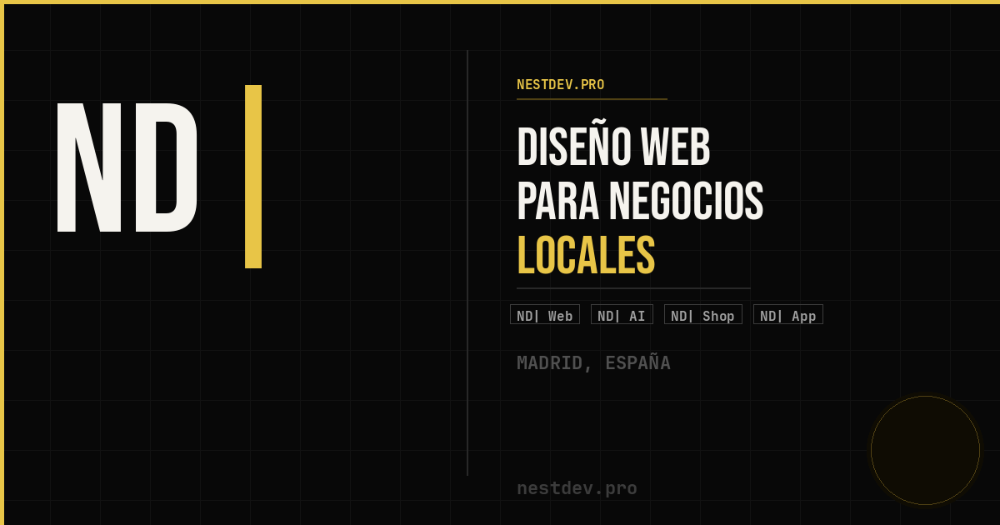

# 👋 Hola, soy Nestor Negrín

**Desarrollador web full-stack** · Madrid, España

Llevo más de 2 años construyendo productos web de principio a fin: desde la
interfaz hasta la base de datos. Ahora mismo dedico la mayor parte de mi
tiempo a **NestDev**, mi agencia de desarrollo web para negocios locales.

Me interesa especialmente la automatización de procesos y la integración
de IA en herramientas de trabajo del día a día.

## 🚀 NestDev

Fundé **NestDev** en 2025: una pequeña agencia en Madrid que construye
webs y sistemas de gestión para negocios locales (restaurantes, talleres,
gimnasios) que no tienen acceso a las mismas herramientas digitales que
las grandes empresas, sin la complejidad ni el coste que eso suele
implicar.

Cada proyecto incluye web a medida, reservas o citas automatizadas,
avisos por WhatsApp y un panel de administración privado. El desarrollo
interno se apoya en **NEXO**, un asistente de IA propio que organiza
tareas y prioriza el trabajo del equipo en lenguaje natural.

**Demos en producción**
- 🍽️ [Restaurante](https://restaurante-nd.netlify.app) — reservas online + aviso automático por WhatsApp
- 🔧 [Taller mecánico](https://tallereshermanos.netlify.app) — citas en tiempo real + seguimiento por matrícula

🔗 [nestdev.pro](https://nestdev.pro)

## 🛠️ Stack

**Frontend:** HTML5 · CSS3 · JavaScript
**Backend:** Node.js · Express · REST APIs
**Base de datos:** Supabase · SQL · Firebase
**Automatizaciones:** WhatsApp API · Resend · Webhooks
**Despliegue:** Netlify · Dominios · SSL

## 📍 Enlaces

| | |
|---|---|
| 🌐 Web | [nestdev.pro](https://nestdev.pro) |
| 💼 LinkedIn | [Nestor Negrín Pinto](https://www.linkedin.com/in/nestor-negr%C3%ADn-pinto-1185a0389/) |
| 📸 Instagram | [@nestdev.pro](https://www.instagram.com/nestdev.pro) |
| ✉️ Email | [nestor@nestdev.pro](mailto:nestor@nestdev.pro) |
